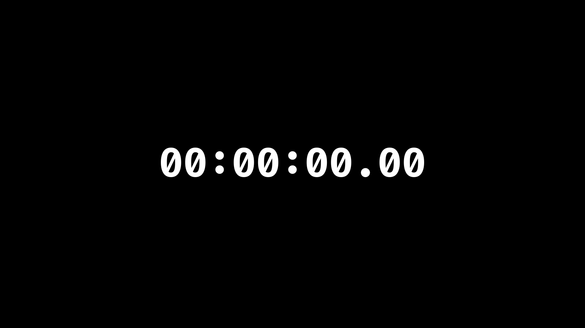

# simple_stopwatch
A stopwatch application that resembles old digital stopwatch devices.

The stopwatch using the system's monospaced font, _Fira Code_

## Installation
Clone this repository, then open the **index.html** file in your browser. 

## About
I created this app, because I could not found a stopwatch app, that worked how a digital stopwatch do.
It blinks, can be stopped or restarted. Mainly, it is really simple, doing just the thing it was meant to.
I pretend to add a reload button in the future, and make it a mobile native app using something like _Ionic_. \
For any demands, just contact me via email.

## Usage
Just click over it, and it will start. \
To stop/pause it, click over it again. \
To reload, reload the page. \
If you want, you can note your times/laps using a note application.
It can also be used for testing your reaction time speeds, and improve concentration, surprisingly. \
And maybe to benchmark hardware response speeds. \
In my tests I realized that screens are faster than mouses, or can help you be faster, at least.
